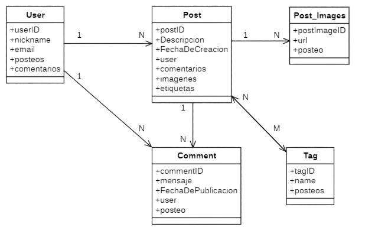

# 🕸️ UnaHur Anti-Social Net - Backend

Este proyecto implementa el backend para **UnaHur Anti-Social Net**, una red anti-social donde los usuarios pueden realizar publicaciones, agregar imágenes mediante URLs, etiquetarlas, y recibir comentarios. También se incluye cache con Redis para mejorar el rendimiento.

---

## 📦 Tecnologías utilizadas

- Node.js + Express
- MongoDB + Mongoose
- Redis (caché)
- .env (configuración)
- Docker y docker-compose
- Swagger (documentación de API)

---

## 🧩 Diagrama UML

El siguiente diagrama muestra la relación entre las entidades principales del sistema:



---

## 📁 Estructura del Proyecto

```
/mi-proyecto
├── assets
├── node_modules
├── src
│   ├── db
│   ├── mongoSchemas
│   │   ├── commentschemas.js
│   │   ├── postschemas.js
│   │   ├── userschemas.js
│   │   ├── tagschemas.js
│   │   ├── post_imageschemas.js
│   │   └── index.js        
│   ├── mongodb.js            
│   ├── rediscache.js       
│
├── controllers
│   ├── comment.controller.js
│   ├── post.controller.js
│   ├── user.controller.js
│   ├── tag.controller.js
│   ├── post_image.controller.js
│   └── index.js             
│
├── router
│   ├── comment.routes.js
│   ├── post.routes.js
│   ├── user.routes.js
│   ├── tag.routes.js
│   ├── post_image.routes.js
│   └── index.js          
│
├── main.js                  
├── .env
├── .gitignore
├── docker-compose.yml
├── package-lock.json
└── package.json
└── readme.md
```

---

## ⚙️ Configuración de entorno

Crear un archivo `.env` con las siguientes variables:

```
PORT=3000
DB_URI=mongodb://mongo:27017/antisocial
REDIS_HOST=redis
REDIS_PORT=6379
COMMENTS_MAX_AGE_MONTHS=6
```

---

## 🚀 Uso

### Instalación

```
npm install
```

### Ejecución en desarrollo

```
npm run dev
```

### Producción

```
npm start
```

### Con Docker

```
docker-compose up
```

---

## 🔧 Funcionalidades

- Registro de usuarios únicos mediante `userId`
- CRUD de publicaciones con descripción obligatoria
- Imágenes asociadas a publicaciones por URL
- Etiquetas reutilizables entre publicaciones
- Comentarios asociados a publicaciones
- Ocultamiento de comentarios según antigüedad (configurable)
- Caché en Redis para endpoints de lectura
- Validaciones y estructura de datos con Mongoose

---

## 📚 Documentación de la API

Disponible vía Swagger en:

```
http://localhost:3000/api-docs
```

Incluye:
- Endpoints CRUD de usuarios, posts, comentarios, imágenes y etiquetas
- Esquemas de datos
- Parámetros requeridos
- Ejemplos de request y response

---

## 📦 Base de datos

- MongoDB con esquemas definidos en `/src/mongoSchemas`
- Redis para almacenamiento en caché de respuestas frecuentes
- Conexión configurada en `mongodb.js` y `rediscache.js`

---

## ✨ Bonus

- [x] Caché con Redis para endpoints GET
- [ ] Sistema de seguidores entre usuarios
- [ ] Optimización con índices o agregaciones

---

## 🧪 Pruebas

Se recomienda el uso de Postman o Thunder Client.  

---

## 🧑‍💻 Autores

Proyecto académico desarrollado en el marco de la Universidad Nacional de Hurlingham (UnaHur). Equipo de desarrollo:
* Diego Andrés Primera
* Facundo Gabriel Gutiérrez
* Franco Cantero
* Luana Belén Calderón 
---